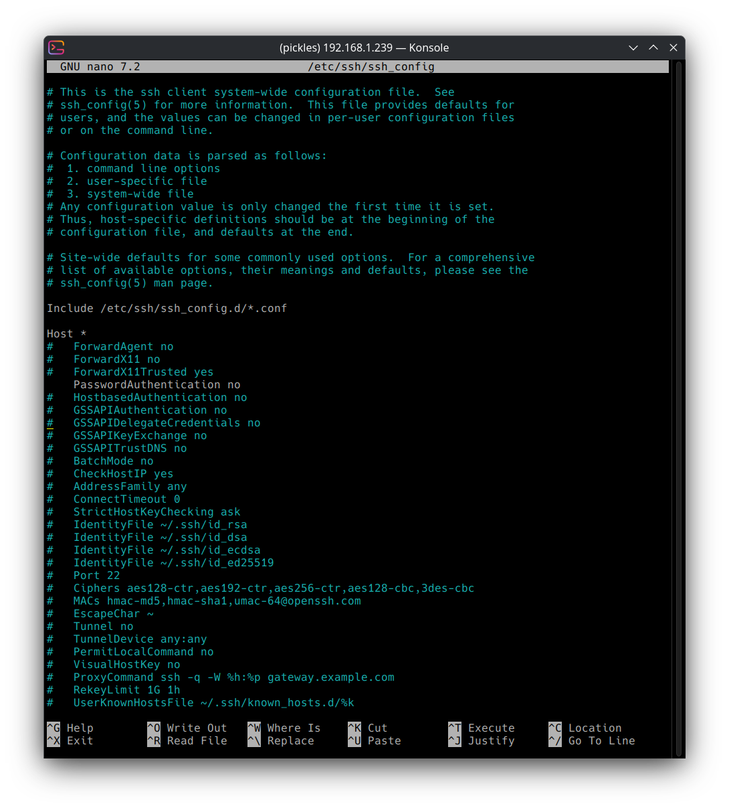
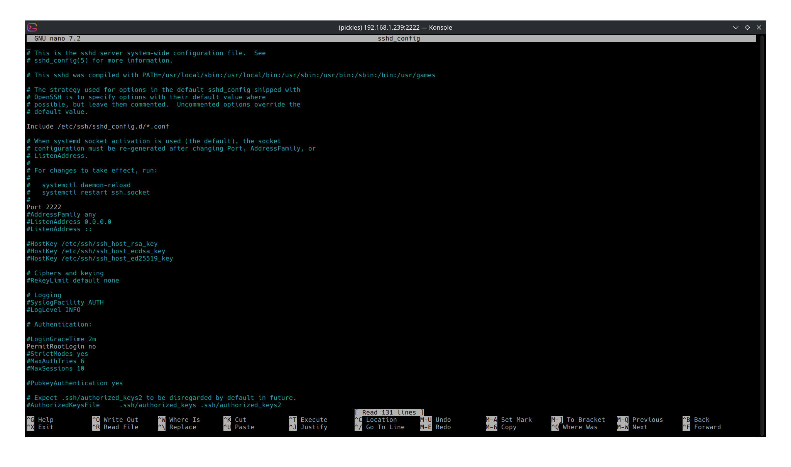
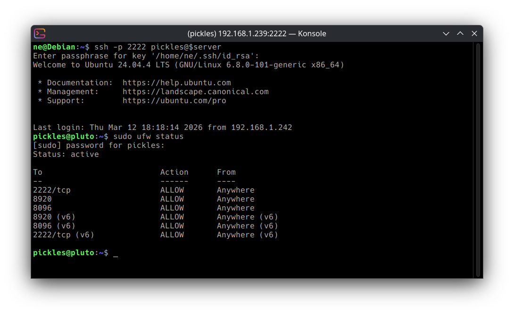
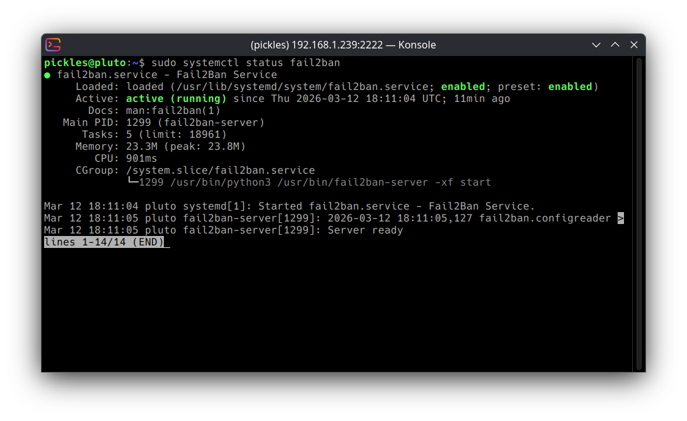

# Linux-SSH-Hardening-lab

## Objective
SSH Hardening of linux server

## Tools Used
- Ubuntu server
- UFW
- Fail2Ban

## Initial Security Vulnerabilities
- No brute-force protection
- root login enabled
- Passwords authentification enabled
- default port for ssh (22)
- unlimited login attempts

## Hardening Steps Taken

### Disable login with password and require public key

### Disable Root login and change ssh port to 2222

### Configure UFW to allow ssh traffic on port 2222 only

### Enable brute-force protection (Fail2Ban)

## Security Improvements
- Prevent direct root attacks by disabling root login
- Eliminate password brute-force by enabling SSH keys
- Customize SSH port to reduce automated scans
- Limit network exposure by setting firewall rules
- Block brute-force attempts by enablin Fail2Ban

## Skills Used
- Linux system administration
- SSH configuration
- Firewall configuration
- Security Hardening
- Brute-force mitigation
- Access control implementation

